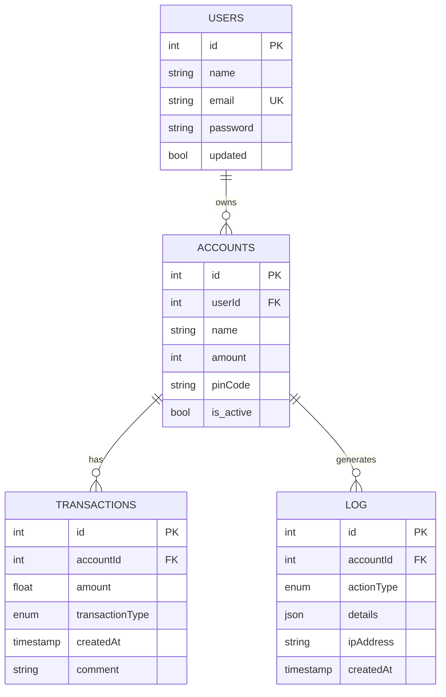

# Database

## Tables

```text
users
accounts
transactions
log
alembic_version   # managed by Alembic, not app data
```

## Enums

```text
transactiontype: 
DEPOSIT | WITHDRAWAL | TRANSFER

actiontype: 
TRANSACTION_CREATED | TRANSACTION_FAILED | LOGIN_FAILED
```

## Relationships

```text
User (1) ──< (N) Account
Account (1) ──< (N) Transaction
Account (1) ──< (N) Log
```

## Entity Relationship Diagram

